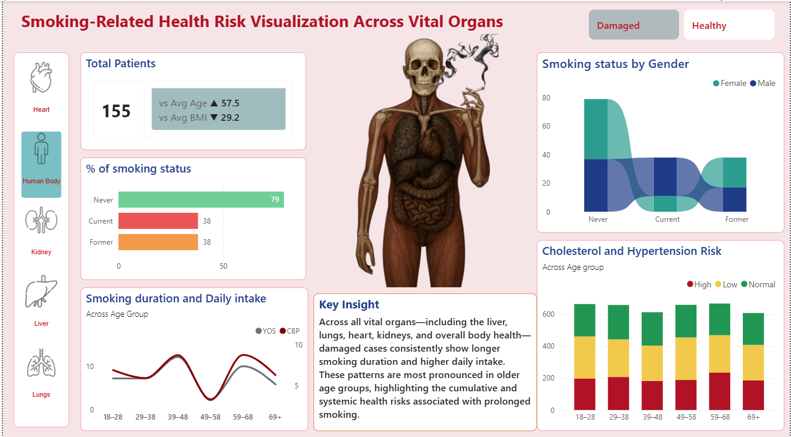
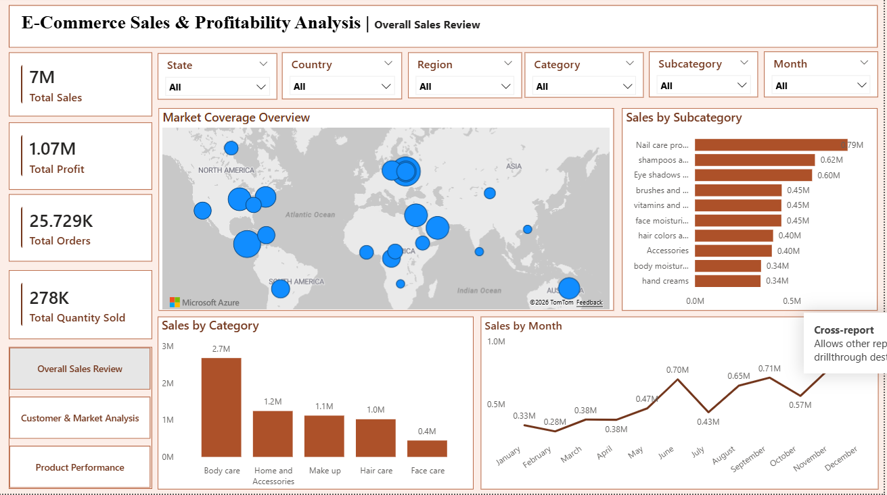
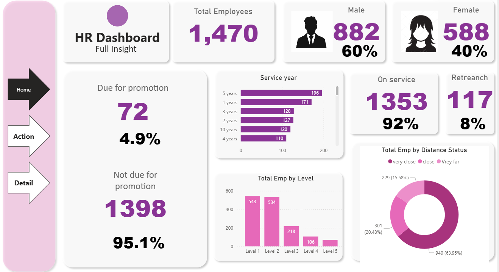

# Munawer Jabeen | Data Analyst Portfolio

Hi, I’m **Munawer Jabeen** 👋  
Data Analyst delivering **SQL- and Power BI-driven insights** to support **business, healthcare, and HR analytics** decision-making.  
I work on **end-to-end analytics projects** — from data cleaning and analysis to dashboarding and insight communication — with a strong focus on **clarity, usability, and real-world relevance**.

[🌐 View Portfolio Online](https://mjabeen164.github.io/)  

---

## 🛠 Core Skills
**Technical Skills:** SQL, Python (Pandas, Matplotlib), Power BI, Tableau, Excel (Pivot Tables, KPIs, Dashboards)  
**Analytics Domains:** Healthcare Analytics, Business Performance, People Analytics  
**Other Skills:** Data Cleaning, Visualization, Dashboard Design, KPI Tracking  

---

## ⭐ Featured Projects

### 1. 🫁 Smoking-Related Health Risk Analysis
  
**Domain:** Healthcare Analytics | **Tools:** SQL, Power BI  
**Problem:** Understand how smoking duration and intensity impacts different vital organs and overall health risk.  
**What I Did:**
- Modeled and analyzed smoking behavior, demographics, and organ-level health indicators using SQL  
- Built an interactive Power BI dashboard to compare risk across organs, age groups, and smoking patterns  
**Key Insight:** Smoking-related health risks are systemic rather than isolated, increasing sharply with longer smoking duration and higher daily intake — particularly among older populations.  
🔗 [View GitHub Repository](https://github.com/Mjabeen164/Smoking-Related-Health-Risk-Analysis-Across-Vital-Organs)

---

### 2. 🛒 E-Commerce Sales & Profitability Analysis
 
**Domain:** Business Analytics | **Tools:** SQL, Power BI  
**Problem:** Sales were growing, but profitability was inconsistent across categories and regions.  
**What I Did:**
- Analyzed revenue, profit, discounting, and product performance  
- Designed dashboards to track margin erosion and identify loss-making categories  
**Key Insight:** High revenue does not guarantee profitability — aggressive discounting significantly reduced margins in multiple categories.  
🔗 [View GitHub Repository](https://github.com/Mjabeen164/E-Commerce-Sales-Profitability-Analysis)

---

### 3. 👥 HR Analytics Dashboard
 
**Domain:** People Analytics | **Tools:** Power BI  
**Problem:** Identify patterns driving employee attrition and department-level retention risk.  
**What I Did:**
- Analyzed employee tenure, attrition trends, and departmental distribution  
- Built a Power BI dashboard to highlight high-risk segments  
**Key Insight:** Early-tenure employees and specific departments consistently show higher attrition risk, pointing to onboarding and role-fit gaps.  
🔗 [View GitHub Repository](https://github.com/Mjabeen164/HR-Analytics-Dashboard----Power-BI)

---

## 📘 Practice & Learning Projects
- SQL query practice & exploratory analysis  
- Python EDA projects (Pandas, Matplotlib)  
- Power BI dashboard experiments  
- Continuous improvement on visualization & insights  

---

## 📬 Contact
- **Email:** [munawerjabeen703@gmail.com](mailto:munawerjabeen703@gmail.com)  
- **LinkedIn:** [linkedin.com/in/munawer-jabeen](https://www.linkedin.com/in/munawer-jabeen-900811380/)  

---

## 🔖 GitHub Topics
`Data-Analyst` `SQL` `Power-BI` `Healthcare-Analytics` `Business-Analytics` `HR-Analytics` `Portfolio`  

---

**Notes for Recruiters / Visitors:**  
- Use the top navigation buttons on the portfolio page to view projects in **Healthcare, Business, or HR-first order** depending on your interest.  
- Each project highlights **real-world business problems, actionable insights, and interactive dashboards**.  
- Practice & learning projects demonstrate **ongoing skill development and commitment to analytics excellence**.
